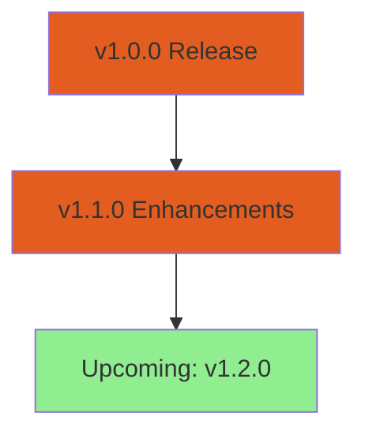

## Overview

Paperguide evolves rapidly to enhance your research workflow. Review recent releases below to discover new AI-powered features, performance improvements, and bug fixes that streamline reading, writing, and reference management.

<Columns cols={3}>
  <Card title="v1.1.0" icon="zap" href="#v1-1-0">
    Enhanced analysis tools and smarter discovery.
  </Card>
  <Card title="v1.0.0" icon="rocket" href="#v1-0-0">
    Initial stable release with core functionality.
  </Card>
  <Card title="Upcoming" icon="eye" href="#upcoming">
    Preview of features in development.
  </Card>
</Columns>

## Recent Releases

<Update label="2024-10-15" description="v1.1.0" tags={["feature", "improvement"]}>

## New Features

- **Smart Citation Suggestions**: AI now recommends relevant citations from your library during writing, reducing manual searches.
- **Collaborative Notes**: Share annotated PDFs with team members in real-time for group research projects.

## Improvements

- Faster document parsing with optimized OCR for scanned papers, achieving `<30s` average upload times.
- Enhanced search with semantic understanding, surfacing papers by conceptual relevance beyond keywords.

## Bug Fixes

- Resolved sync issues across devices, ensuring your library updates instantly.
- Fixed export errors for BibTeX and RIS formats.

</Update>

<Update label="2024-09-10" description="v1.0.0" tags={["feature", "breaking"]}>

## New Features

- **Unified Research Assistant**: Core AI chat integrates reading summaries, question answering, and writing aids.
- **Reference Manager**: Auto-import from DOIs, PubMed, and arXiv with duplicate detection.
- **Writing Assistant**: Generate outlines, paraphrase sections, and check plagiarism powered by advanced models.

## Breaking Changes

- Updated API endpoints for integrations; migrate `researcher/v1/query` to `paperguide/query`.

<CodeGroup tabs="JavaScript,Python">
  ```javascript
  // Old
  const oldResponse = await fetch('https://api.paperguide.com/researcher/v1/query', {
    method: 'POST',
    body: JSON.stringify({query: 'machine learning'})
  });

  // New
  const response = await fetch('https://api.paperguide.com/paperguide/query', {
    method: 'POST',
    headers: {'Authorization': `Bearer ${YOUR_API_KEY}`},
    body: JSON.stringify({query: 'machine learning'})
  });
  ```
  ```python
  import requests

  # Old
  response = requests.post('https://api.paperguide.com/researcher/v1/query', json={'query': 'machine learning'})

  # New
  response = requests.post(
      'https://api.paperguide.com/paperguide/query',
      json={'query': 'machine learning'},
      headers={'Authorization': f'Bearer {YOUR_API_KEY}'}
  )
  ```
</CodeGroup>

## Bug Fixes

- Corrected UI glitches in mobile view for library browsing.

</Update>

## Stay Updated

Follow these steps to ensure you run the latest version:

<Steps>
  <Step title="Check Version" icon="info">
    Navigate to your account settings and view the current version under `About Paperguide`.
  </Step>
  <Step title="Enable Auto-Updates" icon="settings">
    Toggle auto-updates in preferences to receive features seamlessly.
  </Step>
  <Step title="Review Integrations" icon="plug">
    Test API calls with updated endpoints if you use custom scripts.
  </Step>
</Steps>

<Callout kind="tip">
  Subscribe to email notifications in your profile for instant alerts on major releases.
</Callout>

## Upcoming Features

Preview what's next to supercharge your research:

<ExpandableGroup>
  <Expandable title="AI-Powered Literature Review" default-open="true">
    Automated synthesis of themes across 100+ papers, generating review drafts in minutes.
  </Expandable>
  <Expandable title="Advanced Visualizations">
    Interactive graphs of citation networks and topic clusters.
  </Expandable>
  <Expandable title="Voice-Activated Assistant">
    Query your library hands-free using speech-to-text.
  </Expandable>
</ExpandableGroup>

