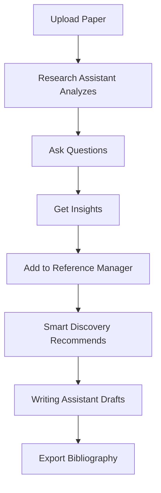

## Overview

Paperguide revolutionizes research with AI-powered tools that handle discovery, organization, and writing. You interact with a unified platform where the Research Assistant analyzes papers, the Reference Manager organizes citations, and the Writing Assistant generates insights. These core features work together to save time and boost productivity.

<Columns cols={3}>
  <Card title="Research Assistant" icon="search" href="/docs/research-assistant">
    AI analyzes documents and answers queries instantly.
  </Card>
  <Card title="Reference Manager" icon="book-open" href="/docs/reference-manager">
    Import, organize, and cite references effortlessly.
  </Card>
  <Card title="Writing Assistant" icon="edit-3" href="/docs/writing-assistant">
    Generate summaries, outlines, and smart suggestions.
  </Card>
</Columns>

## Research Assistant Functionality

The Research Assistant uses advanced AI to process PDFs, extract key insights, and respond to your questions. Upload a paper, ask about methodologies or findings, and receive concise answers with evidence.

<Steps>
  <Step title="Upload Document" icon="upload">
    Drag and drop your PDF or use the import button.
  </Step>
  <Step title="Ask Questions" icon="message-circle">
    Type natural language queries like "What is the main hypothesis?"
  </Step>
  <Step title="Review Insights" icon="check-circle">
    Get highlighted sections and AI-generated summaries.
  </Step>
</Steps>

<Callout kind="tip">
  For best results, provide context in your queries, such as "Compare this to recent studies on climate change."
</Callout>

## Reference Manager Capabilities

Paperguide's Reference Manager centralizes your library. Import from multiple formats, tag items, and generate bibliographies. It integrates seamlessly with writing tools.

<Tabs>
  <Tab title="RIS Import" icon="file-text">
    Use standard RIS files from databases like PubMed.

````ris
TY  - JOUR
TI  - AI in Research
AU  - Smith, J.
PY  - 2024
```
````

  </Tab>
  <Tab title="BibTeX Import" icon="code">
    Import BibTeX for LaTeX users.

````bibtex
@article{smith2024,
  title={AI in Research},
  author={Smith, J.},
  year={2024},
  journal={Journal of AI}
}
```
````

  </Tab>
</Tabs>

## Writing Assistant and Smart Discovery

The Writing Assistant helps draft sections, suggest citations, and refine prose. Smart Discovery recommends related papers based on your library and queries.

<ExpandableGroup>
  <Expandable title="How Smart Discovery Works" default-open="true">
    Enter keywords or upload a draft. The AI scans your references and external sources to suggest 5-10 relevant papers with similarity scores.
  </Expandable>
  <Expandable title="Integration Example">
    Use the JavaScript SDK to embed discovery in your app.

<CodeGroup tabs="JavaScript,Python">
```javascript
import { Paperguide } from '@paperguide/sdk';

const client = new Paperguide({ apiKey: 'YOUR_API_KEY' });
const recommendations = await client.discovery.search({
  query: 'machine learning ethics',
  limit: 10
});
console.log(recommendations);
```
```python
from paperguide import Paperguide

client = Paperguide(api_key="YOUR_API_KEY")
recommendations = client.discovery.search(
    query="machine learning ethics",
    limit=10
)
print(recommendations)
```
</CodeGroup>

  </Expandable>
</ExpandableGroup>



This workflow ensures your research flows from discovery to polished output without switching tools.