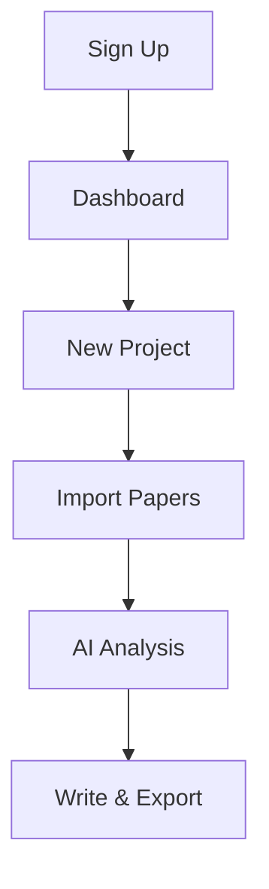

## Get Started with Paperguide

Paperguide streamlines your research workflow with AI-powered tools for discovery, analysis, and writing. Follow these steps to create an account, explore the dashboard, and launch your first project in under 5 minutes.

<Callout kind="tip">
  You need a valid email address to sign up. Paperguide offers free access for individual researchers with generous limits.
</Callout>

## Create Your Account

Sign up and log in to access the platform.

<Steps>
  <Step title="Visit the Sign-Up Page" icon="globe">
    Navigate to [app.paperguide.com/signup](https://app.paperguide.com/signup) in your browser.
  </Step>
  <Step title="Enter Your Details" icon="user">
    Provide your email, create a strong password, and complete the CAPTCHA.
  </Step>
  <Step title="Verify Email" icon="mail">
    Check your inbox for a verification link from Paperguide and click it to activate your account.
  </Step>
  <Step title="Log In" icon="log-in">
    Return to the login page, enter your credentials, and access your dashboard.
  </Step>
</Steps>

## Explore the Dashboard

The dashboard provides quick access to your core tools. Key sections include:

<Columns cols={3}>
  <Card title="Projects" icon="folder" href="/docs/projects">
    Manage your research collections and tasks.
  </Card>
  <Card title="Discover" icon="search" href="/docs/discover">
    Find relevant papers using smart search.
  </Card>
  <Card title="Analyze" icon="zap" href="/docs/analyze">
    Get AI insights from your documents.
  </Card>
</Columns>

## Set Up Your First Project

Create a project to organize your research. Choose your preferred import method.

<Tabs>
  <Tab title="Manual Entry" icon="edit">
    <Steps>
      <Step title="Create Project">
        Click **New Project** on the dashboard. Name it `AI Ethics in Machine Learning` and add a description.
      </Step>
      <Step title="Add Notes">
        Use the built-in editor to jot down initial thoughts.
      </Step>
    </Steps>
  </Tab>
  <Tab title="Import References" icon="upload">
    Paperguide supports common formats like BibTeX and RIS.

    <CodeGroup tabs="BibTeX,RIS">
```bibtex
@article{smith2023ethics,
  title={Ethics in AI: A Review},
  author={Smith, J. and Doe, A.},
  journal={AI Journal},
  year={2023},
  volume={15},
  pages={123-145}
}
```
```ris
TY  - JOUR
TI  - Ethics in AI: A Review
AU  - Smith, J.
AU  - Doe, A.
PY  - 2023
VL  - 15
SP  - 123
EP  - 145
JF  - AI Journal
ER  -
```
    </CodeGroup>

    Drag and drop files or paste content into the import tool.
  </Tab>
</Tabs>

<Expandable title="Common Import Issues" default-open="false">
If imports fail, ensure your file uses UTF-8 encoding and contains valid citation data. Contact support@paperguide.com for large batches.
</Expandable>

## Next Steps

Congratulations—you're ready to research! Dive into discovery tools to find papers, analyze them with AI, or collaborate on projects. Track progress in your dashboard overview.



<Callout kind="success">
  Your first project unlocks premium features like unlimited AI queries for 7 days. Explore all tools without restrictions.
</Callout>