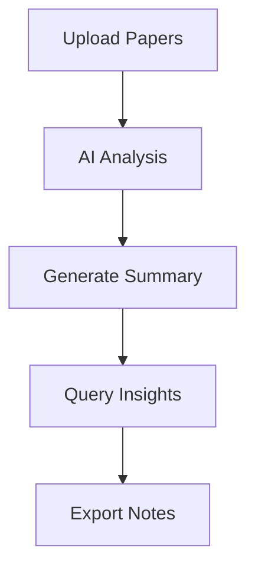

## Overview

Paperguide empowers you to manage references, perform intelligent analysis, and integrate tools seamlessly for efficient research. Start by importing your documents, then use AI-driven insights to organize and analyze content. This guide walks you through key workflows to boost your productivity.

<Columns cols={3}>
  <Card title="Manage References" icon="book-open" href="#managing-references">
    Organize PDFs, notes, and citations effortlessly.
  </Card>
  <Card title="Intelligent Analysis" icon="zap" href="#intelligent-analysis">
    Extract insights with AI-powered summaries and queries.
  </Card>
  <Card title="Streamlined Writing" icon="edit-3" href="#streamlined-writing">
    Integrate tools for drafting and exporting papers.
  </Card>
</Columns>

## Managing and Organizing References

Organize your research library by importing sources and tagging them for quick access.

<Steps>
  <Step title="Import Documents" icon="upload">
    Drag and drop PDFs or enter DOIs directly into the library.

    ```bash
    # Example DOI import via CLI tool
    paperguide import --doi 10.1038/s41586-021-04232-5
    ```
  </Step>
  <Step title="Add Tags and Notes" icon="tag">
    Highlight sections and assign tags like `machine-learning` or `review-needed`.
  </Step>
  <Step title="Create Collections" icon="folder">
    Group related papers into collections for projects.
  </Step>
</Steps>

<Callout kind="tip">
  Use the search bar with filters like `tag:machine-learning after:2023` to find references quickly.
</Callout>

## Performing Intelligent Analysis

Leverage Paperguide's AI to summarize papers, compare sources, and answer queries.

<Tabs>
  <Tab title="Summarize Paper" icon="file-text">
    Select a document and click "Analyze" > "Generate Summary".

    <Image
      src="https://paperguide.com/docs/images/summary-example.png"
      alt="AI-generated summary of a research paper"
      width="800"
      height="400"
    />
  </Tab>
  <Tab title="Query Across Library" icon="search">
    Ask natural language questions like "What methods handle noisy data?".

    <CodeGroup tabs="JavaScript,Python">
      ```javascript
      // Query via Paperguide JS SDK
      const results = await paperguide.query({
        question: "Best models for NLP tasks?",
        sources: ["library"]
      });
      console.log(results.insights);
      ```
      ```python
      # Query via Python client
      from paperguide import Client
      client = Client(api_key="YOUR_API_KEY")
      results = client.query("Latest trends in quantum computing")
      print(results)
      ```
    </CodeGroup>
  </Tab>
</Tabs>



<Expandable title="Advanced Query Tips" default-open="false">
  Combine operators: `author:Smith AND topic:AI ethics >2020`.
</Expandable>

## Integrating Tools for Streamlined Writing

Connect Paperguide with your writing workflow for citations and drafting.

| Integration | Description | Setup |
|-------------|-------------|-------|
| Zotero      | Sync references bidirectionally | Enable in Settings > Integrations |
| Google Docs | Auto-insert citations | Install Paperguide add-on |
| Overleaf    | Export BibTeX directly | Click "Export" > BibTeX |

<Steps>
  <Step title="Export Citations" icon="download">
    Select references and choose BibTeX or RIS format.
  </Step>
  <Step title="Writing Assistant" icon="pen-tool">
    Use AI to draft sections: "Expand this outline into a paragraph".
  </Step>
  <Step title="Collaborate" icon="users">
    Share collections with team members for real-time feedback.
  </Step>
</Steps>

<Callout kind="info">
  All integrations require a valid `YOUR_API_KEY` from your account settings.
</Callout>

This setup ensures your research flows from discovery to publication without friction. Explore these features to uncover deeper insights faster.